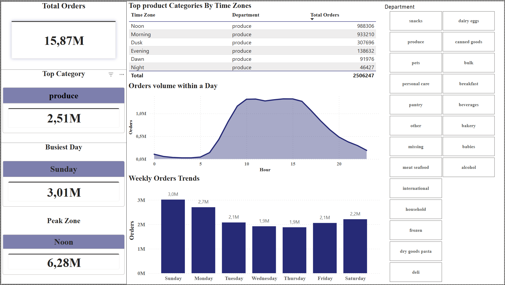

# 🛒 Instacart Market Basket Analysis & Dashboard

## 📂 Project Files
* 📊 **Power BI File:** The completed dashboard has been uploaded to the repository (you can download the file to open it locally and explore its interactivity).
* 💾 **SQL Scripts:**
  * `01_table_creation.sql` - Database schema setup
  * `02_data_integration.sql` - Fact tables integration
  * `03_dataset_transformation.sql` - Data preparation and aggregation

---

## 🎯 The Scenario (Fictional Business Case)
For the purposes of this portfolio project, I worked on a fictional business case assigned to me by an AI chatbot. The chatbot asked me to analyze the Instacart data to answer the following question:

> "How do the time of day and the day of the week affect consumer purchases, and which product categories (departments) show the highest demand across different time zones?"

---

## 🗄️ 1. Database Setup (PostgreSQL)
Everything started in PostgreSQL, where I set up the initial relational schema to receive the raw data. I created the tables with the appropriate Primary Keys to ensure data integrity:

* **`orders`**: The main order history.
* **`products` / `aisles` / `departments`**: Product metadata tables.
* **`order_products_prior` / `order_products_train`**: Tables linking products to each order.

*(The code can be found in `01_table_creation.sql`)*

---

## 🔄 2. Data Integration
The order data was split across two separate tables (`prior` and `train`). To analyze them properly:
* I used **`UNION ALL`** to create a central, unified fact table (`fact_order_products`).
* I added a Composite Primary Key on the `(order_id, product_id)` fields to prevent duplicate records.
* I deleted the initial staging tables to lighten the database.

*(The code can be found in `02_data_integration.sql`)*

---

## ⚡ 3. Preparation & Aggregation (SQL)
To prevent Power BI from lagging by loading millions of rows, I did all the heavy lifting of aggregation directly in SQL using a query with CTEs:

1. **Days of the week**: I mapped the numeric values (0-6) to the actual names of the days (`Sunday` to `Saturday`) using `CASE WHEN`.
2. **Time Zones (Time Binning)**: I created custom logic, dividing the 24-hour day into 6 practical zones (`Night`, `Dawn`, `Morning`, `Noon`, `Dusk`, `Evening`) using `CASE WHEN` as well.
3. **Data Aggregation**: I compressed the dataset by counting the unique orders (`COUNT(DISTINCT order_id)`) per department, day, and hour. This way, Power BI only received the necessary aggregated figures, while maintaining flexibility in filtering.

*(The code can be found in `03_dataset_transformation.sql`)*

---

## 📊 4. Power BI Dashboard Design
The goal here was to build a clean and intuitive dashboard, ready to be read by a manager at a glance:

* **Executive KPI Sidebar**: A vertical bar on the left displaying the "big numbers" (Total Orders, Top Category, Busiest Day, Peak Zone) for an immediate overview.
* **Slicer UX**: Instead of a simple drop-down menu, I styled the Departments filter to look like buttons (Tile layout) on the right, making the dashboard much more user-friendly and modern.
* **Edit Interactions**: I locked (`None`) the interactions on the Top Category, Busiest Day, Peak Zone, ensuring that when the user clicks on the charts, the company's overall totals remain static as a point of reference.
* **Data Visualization**: I used a table for the top departments, an Area Chart to clearly show the demand curve throughout the day and a Column Chart for the days of the week, tying it all together with a uniform (Slate/Indigo) color palette.